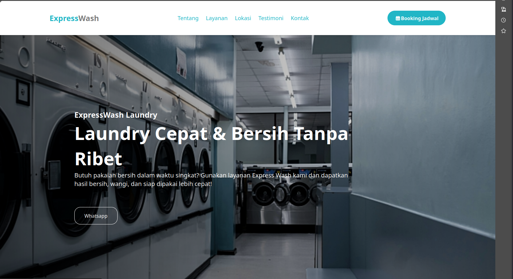
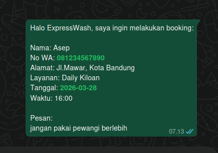

# ExpressWash - Laundry Website

A modern and responsive landing page for a laundry service business. Designed with a clean UI and smooth user experience to help customers easily book services and explore offerings.

## Preview

## Features

* Fully responsive (mobile-friendly)
* Booking form integrated with WhatsApp
* Interactive testimonial section
* Clean and modern UI design
* Fast loading (pure HTML, CSS, JavaScript)

## Tech Stack

* HTML5
* CSS3
* JavaScript

## How to Run

1. Clone this repository
2. Open `index.html`
3. Run it in your browser

## Live Demo

https://expresswash.netlify.app

## Use Case

This website is suitable for:

* Laundry businesses
* Small service-based businesses
* Landing pages for local services

## WhatsApp Booking Message Preview

## Author

Created by Almerd
